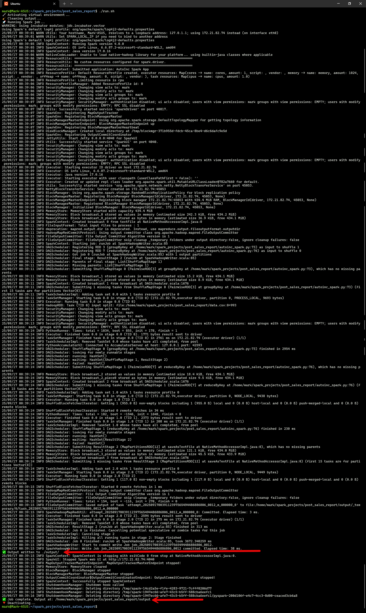
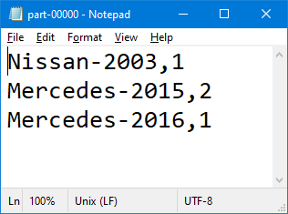

# Apache Spark Post Sales Redesign Mini Project

## 📖 Abstract
This mini project uses Apache Spark and PySpark to analyze post-sales automotive data. The task is to group records by vehicle make and year, count their occurrences, and save the result to HDFS-compatible output using Spark’s distributed text format. The project reinforces Spark RDDs, map-reduce patterns, and the HDFS write model — all executed locally in a WSL2 Ubuntu environment.

## 🛠 Requirements
- WSL2 with Ubuntu 22.04
- Java and Apache Spark installed locally
- Python 3 and virtual environment (venv)
- PySpark installed in venv
- Basic understanding of RDD operations and Spark job submission

## 🧰 Setup
- Ensure Java and Apache Spark are installed in Ubuntu
- Create and activate a virtual environment
- Install PySpark via pip
- Use the provided run.sh script to:
  - Activate the virtual environment
  - Delete any previous Spark output directory
  - Submit the job via spark-submit
  - Deactivate the environment afterward

## 📊 Dataset
- A single CSV file: data.csv
- Each row represents a vehicle record
- Fields include Make, Model, and Year

## ⏱️ Run Steps
- Open Ubuntu terminal (WSL2)
- Navigate to the project directory:
    wsl
    cd ~/spark_projects/post_sales_report
- Run the job:
    bash run.sh

## 📈 Outputs
- Output written to ./output/ directory
- Main data file: part-00000
- Each line formatted as Make-Year,Count
- Includes Spark _SUCCESS marker

## 📸 Evidence

  
Terminal output showing successful Spark execution and file creation

  
Screenshot of generated part-00000 file content

## 📎 Deliverables

- [`autoinc_spark.py`](./deliverables/autoinc_spark.py)

- [`run.sh`](./deliverables/run.sh)

## 🛠️ Architecture
- Local Spark job (single-node)
- RDD-based transformation pipeline
- Output stored using Spark's saveAsTextFile() (HDFS-compatible directory structure)

## 🔍 Monitoring
- Job success confirmed via _SUCCESS file
- Output reviewed in part-00000 file
- Basic timing and logging in terminal

## ♻️ Cleanup
- run.sh deletes output directory on re-run
- Virtual environment excluded via .gitignore
- Optional: archive outputs and screenshots post-run

*Generated automatically via Python + Jinja2 + SQL Server table `tblMiniProjectProgress` on 09-17-2025 01:32:55*