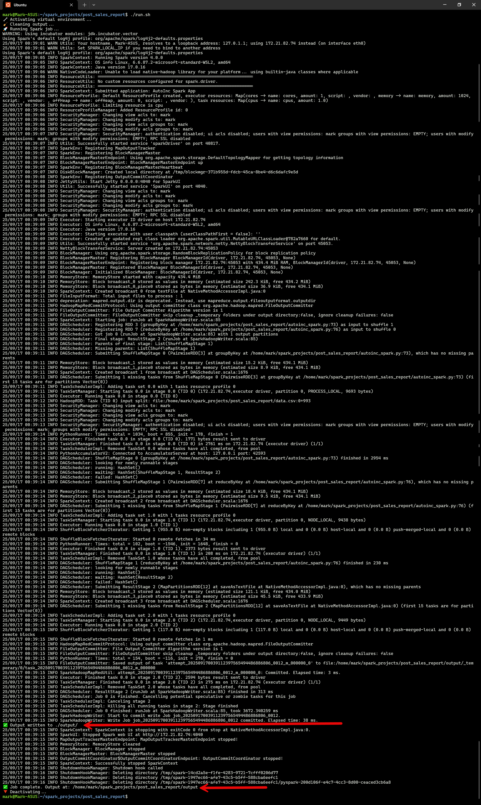

# Apache Spark Post Sales Redesign Mini Project

## 📖 Abstract
This project focuses on redesigning an existing post-sales data pipeline in Apache Spark. You are tasked with generating a refreshed sales report using historical and customer churn data. The goal is to restructure the existing pipeline for improved maintainability, incorporate Spark SQL transformations, and deliver insights for business decision-makers. The redesigned pipeline outputs refined datasets and aggregated metrics useful for post-sales analysis.

## 🛠 Requirements
- Ubuntu / WSL environment
- Java and Apache Spark installed locally
- PySpark (Python bindings for Spark)
- WSL2 with Ubuntu 22.04 (via Windows Terminal)
- Python 3
- Virtual environment for dependency isolation

## 🧰 Setup
- Clone the repository or copy the files locally
- Ensure Java, Spark, and Python are correctly installed
- Run the provided shell script (run.sh) which:
  - Activates the virtual environment
  - Deletes previous output directory (if any)
  - Submits the PySpark job
  - Deactivates the environment afterward

## 📊 Dataset
- A CSV file named data.csv located in the project directory
- Contains rows representing automobile sales entries
- Columns include Make, Model, Year, etc.

## ⏱️ Run Steps
- Launch Ubuntu shell in the project directory
- Run bash run.sh
- The script handles environment setup and job submission

## 📈 Outputs
- Output directory written by Spark (./output)
- Contains part-00000 file with final results
- Each line is in the format: Make-Year,Count
- _SUCCESS marker to indicate job completion

## 📸 Evidence

  
Terminal output showing successful Spark execution and file creation

## 📎 Deliverables

- [`autoinc_spark.py`](./deliverables/autoinc_spark.py)

- [`run.sh`](./deliverables/run.sh)

- [`.part-00000.crc`](./deliverables/.part-00000.crc)

## 🛠️ Architecture
- Standalone PySpark job executed via spark-submit
- Local CSV source -> RDD transformation -> grouped counts -> saved text file
- All compute done locally (single-node)

## 🔍 Monitoring
- Observed job status via terminal
- Used _SUCCESS file as job completion confirmation
- Optionally monitored performance via log messages

## ♻️ Cleanup
- Remove generated output/ directory between runs
- Optionally archive logs or old outputs
- Virtual environment stored locally and excluded via .gitignore

*Generated automatically via Python + Jinja2 + SQL Server table `tblMiniProjectProgress` on 09-17-2025 01:11:10*